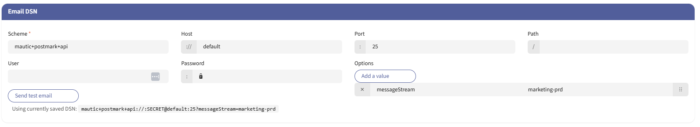

## Warning

This package is a work-in-progress. I'm not a PHP developer and since I do not know much about Mautic or its ecosystem using this package may not be a good idea.
I implemented Postmark support for my own mautic instance because Mautic v5 does not support Postmark anymore and v4 is deprecated.
Since Mautic is a big frustration for me since minute 1, I'm probably abandoning this package soon.

Although, if you want to thank me and want to keep seeing me struggle with PHP and Mautic you can buy me a coffee using the link below:

<a href="https://www.paypal.com/donate/?business=P8YLKWGH3E6XU&no_recurring=1&item_name=If+you+want+to+see+me+keep+struggling+with+PHP+and+Mautic%2C+make+me+happy+and+buy+me+a+coffee+%3A-%29&currency_code=EUR">
  
</a>

### Mautic Postmark Plugin

This plugin enable Mautic 5.x to run Postmark as an email transport. Features:

- API transport.
- Bounce webhook handling. This plugin will unsubscribe contacts in Mautic based on the hard bounces while Postmark will take care of the soft bounce retries.
- Supports Re-Subscribes. The DNC flag will be removed when the webhhook sends `SuppressSending: false`

Be aware that there is a existing symfony postmark bridge, but no recent version is compatible with Mautic 5 and has a webhook support.

### Using a different Message Stream for Transactional and Broadcast Messages

You can you different message streams on a per-email basis. You just have to add the `X-PM-Message-Stream` custom header with the value of your message stream to the mautic email.

#### Mautic Mailer DSN Scheme

`mautic+postmark+api`

#### Mautic Mailer DSN Example

`'mailer_dsn' => 'mautic+postmark+api://:<api_key>@default?messageStream=<messageStream>',`

- api_key: Get Postmark API key from your postmark server setting (`password` in the email configuration ui)
- options:
  - messageStream: the postmark message stream



### Installation in Docker containers

The only "easy" way to use a custom plugin in a docker container is to build a custom image. There are a few things I had to find out the hard way, i.e.

- You have to set the right permissions to the plugin folder, otherwise this plugin won't be visible in the configuration ui
- You need to clear the mautic cache, otherwise - you guessed it - this plugin won't be visible in the configuration ui

This is what I use in my custom docker image

```Dockerfile
FROM mautic/mautic:5.2.3-apache

RUN curl -sS https://getcomposer.org/installer | php -- --install-dir=/usr/bin --filename=composer

RUN apt-get update \
    && apt-get install --no-install-recommends -y \
    git \
    nodejs \
    npm


RUN chown www-data:www-data /var/www/html -R && \
    chown www-data:www-data /tmp -R

RUN chown www-data:www-data /var/www


RUN su -s /bin/bash www-data -c "composer require -vvv --working-dir=/var/www/html/ mariotebest/mautic-postmark-mailer:1.0.13"

# run cache clear as www-data otherwise the permissions will be messed up
RUN su -s /bin/bash www-data -c "php /var/www/html/bin/console cache:clear"

```

### Testing

To run all tests `composer phpunit`

To run unit tests `composer unit`

To run functional tests `composer functional`

### Static analysis tools

To run fixes by friendsofphp/php-cs-fixer `composer fixcs`

To run phpstan `composer phpstan`
